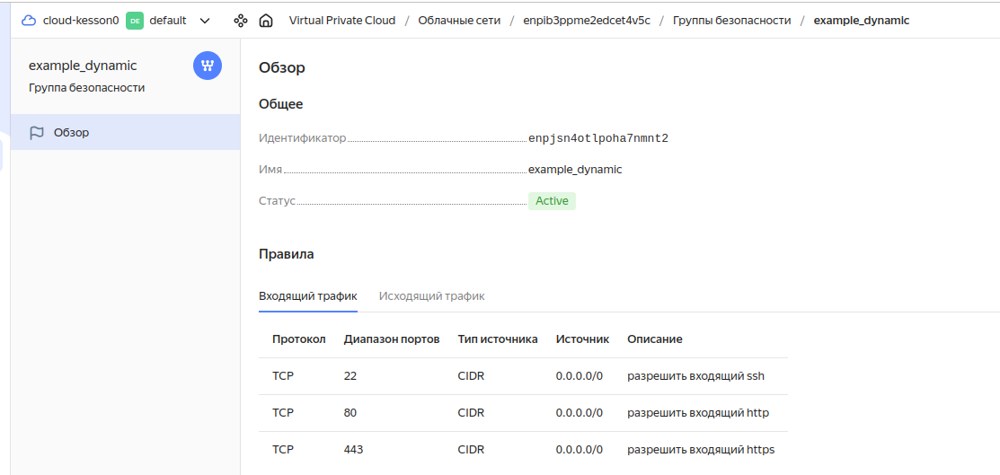

# Домашнее задание к занятию «Управляющие конструкции в коде Terraform»

### Задание 1

Правила «Группы безопасности» в ЛК Yandex Cloud

------
...
------

### Задание 4

Сформированный файл hosts.cfg:

------

итоговые файлы проекта в [**репозитории**](https://github.com/kesson11/terraform-03)